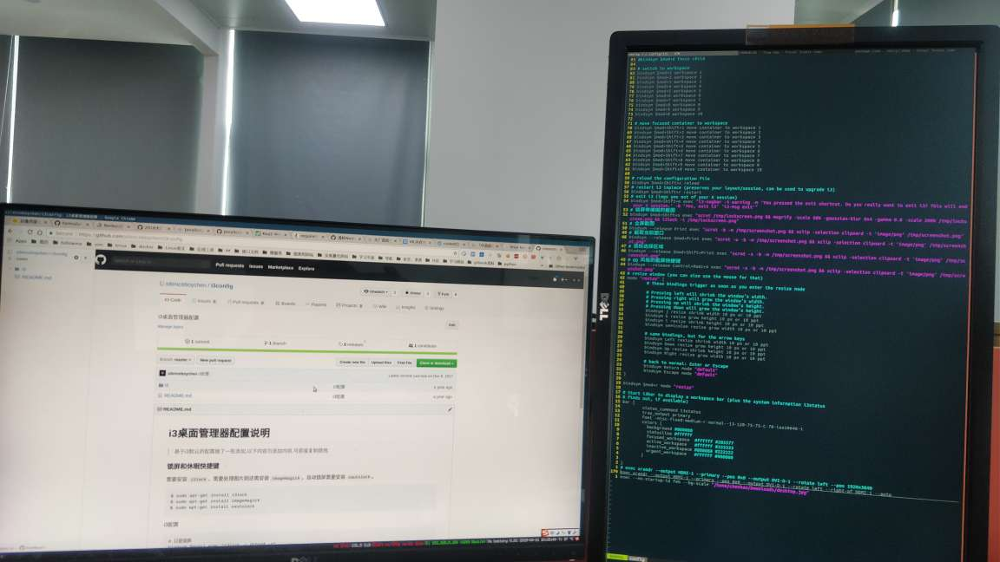

i3桌面管理器配置说明
=====

> 基于i3默认的配置做了一些添加,以下内容为添加内容,可直接复制使用.

### 锁屏和休眠快捷键

需要安装 ``i3lock``，需要处理图片则还需安装 ``imagemagick``，自动锁屏需要安装 ``xautolock``。

```
$ sudo apt-get install i3lock
$ sudo apt-get install imagemagick
$ sudo apt-get install xautolock
```
i3配置

```
# 只是锁屏
bindsym $mod+l exec "i3lock -c 01544A -n"
# 锁屏 + 休眠
# bindsym $mod+Shift+s exec "i3lock && systemctl suspend"
# 锁屏带模糊的截图
bindsym $mod+Shift+s exec "scrot /tmp/lockscreen.png && mogrify -scale 50% -gaussian-blur 0x4 -gamma 0.8 -scale 200% /tmp/lockscreen.png && i3lock -i /tmp/lockscreen.png"
# 10 分钟不活动自动锁屏,这里用了 notify-send 弹出提示
# -notify在锁定之前警告用户的时间长度,单位秒;-notifier指定要使用的通知程序。此选项仅与-notify结合使用
# 这里配置完成后无法执行,需要重启才能生效
exec --no-startup-id xautolock -time 10 -locker 'scrot /tmp/lockscreen.png && mogrify -scale 50% -gaussian-blur 0x4 -gamma 0.8 -scale 200% /tmp/lockscreen.png && i3lock -i /tmp/lockscreen.png' -notify 10 -notifier 'notify-send "锁屏提示:" "还有10秒钟我就要自动锁屏了!" -i /tmp/lockscreen.png'
# 上述内容也可写在shell脚本里,执行shell文件,shell文件要设置为可执行文件: sudo chmod +x lock.sh
# exec ./lock.sh
```

### 截屏并复制到剪贴板

需要安装 ``scrot`` 和 ``xclip``。

```
$ sudo apt-get install scrot
$ sudo apt-get install xclip
```

i3配置

```
# 全屏截图
bindsym --release Print exec "scrot -b -m /tmp/screenshot.png && xclip -selection clipoard -t 'image/png' /tmp/screenshot.png"
# 截取当前窗口
bindsym --release $mod+Print exec "scrot -u -b -m /tmp/screenshot.png && xclip -selection clipoard -t 'image/png' /tmp/screenshot.png"
# 鼠标选择区域
bindsym --release $mod+Shift+Print exec "scrot -s -b -m /tmp/screenshot.png && xclip -selection clipoard -t 'image/png' /tmp/screenshot.png"
# QQ 风格的截屏快捷键
bindsym --release Control+Mod1+A exec "scrot -s -b -m /tmp/screenshot.png && xclip -selection clipoard -t 'image/png' /tmp/screenshot.png"
```

### linux双屏幕设置



我的设置为：
```
exec xrandr --output HDMI-1 --primary --pos 0x0 --output DVI-D-1 --rotate left --right-of HDMI-1 --auto
```

**关于xrandr的设置**

  * 执行xrandr命令
    
    ```
    ➜  ~ xrandr
    Screen 0: minimum 320 x 200, current 3120 x 1920, maximum 16384 x 16384
    DVI-D-1 connected 1200x1920+1920+0 left (normal left inverted right x axis y axis) 518mm x 324mm
       1920x1200     59.95*+
       1920x1080     60.00  
       1600x1200     60.00  
       1680x1050     59.88  
       1280x1024     60.02  
       1280x960      60.00  
       1024x768      60.00  
       800x600       60.32  
       640x480       59.94  
       720x400       70.08  
    HDMI-1 connected primary 1920x1080+0+0 (normal left inverted right x axis y axis) 527mm x 296mm
       1920x1080     60.00*+  50.00    59.94  
       1920x1080i    60.00    50.00    59.94  
       1600x1200     60.00  
       1600x900      60.00  
       1280x1024     75.02    60.02  
       1152x864      75.00  
       1280x720      60.00    50.00    59.94  
       1024x768      75.03    60.00  
       800x600       75.00    60.32  
       720x576       50.00  
       720x480       60.00    59.94  
       640x480       75.00    60.00    59.94  
       720x400       70.08  
    VGA-1 disconnected (normal left inverted right x axis y axis)
    ```

    运行之后会显示当前连接设备的屏幕信息，我的屏幕当前连接了DVI-D-1和HDMI-1，而VGA-1屏幕为disconnect，意为没有连接.

  * 设置双屏幕显示
  
    * 打开外接显示器，双屏幕显示相同的内容--克隆，（auto为最高分辨率）
    ```
    xrandr --output HDMI-1 --same-as DVI-D-1 --auto
    ```
    * 若要指定外接显示器的分辨率可以使用下面的命令（1280*1024）：
    ```
    xrandr --output HDMI-1 --same-as DVI-D-1 --mode 1280x1024
    ```
    * 打开外接显示器，设置为右侧扩展
    ```
    xrandr --output HDMI-1 --right-of DVI-D-1 --auto
    ```
    * 关闭显示器
    ```
    xrandr --output DVI-D-1 --off
    ```
    * 打开HDMI-1接口显示器，关闭DVI-D-1接口显示器
    ```
    xrandr --output HDMI-1 --auto --output DVI-D-1 --off
    ```
    * 设置主屏幕
    ```
    xrandr --output HDMI-0 --primary
    ```

### 背景图设置

```
exec --no-startup-id feh --bg-scale "/home/desktop.jpg"
```

附带我心爱的桌面图片。
